# Clickbait Classification of YouTube Video Titles

## Objective

First we are going to discuss the related work in this field to realize what are the past works done and what are the different methodologies used there. This will help us in identifying different ways of transforming the data so that it could be used properly by the machine learning algorithms. After that we will do the Exploratory Data Analysis which will help us understand the dataset. It is followed by the data pre-processing which is an important step as it helps in converting the string data to values understandable by the algorithms. After that the last step is training the ML model and comparing the accuracy and other different results.

## Description

In this project, we are getting the data from kaggle which contains many types of different datasets. The dataset that we have found will serve its purpose sufficiently in this project. Natural Language Processing along with Machine Learning has been used for training and testing purposes. The various algorithms will be briefly discussed in the below sections. Machine learning algorithms used in this project include Multinomial Naive Bayes, Support Vector Machine (SVM), Random Forest and Bidirectional Encoder Representations from Transformers (BERT).

## Technical Libraries Needed

Google collab with inbuilt GPU.

Libraries of python:

- Scikit Learn
- Numpy
- Pandas
- Seaborn,
- Matplotlib
- Tensorflow

The innovation in our approach is the use of a multilingual dataset of video titles. Using dataset two that has headlines in Indian regional languages like Hindi, Malayalam, Tamil, Telugu and Kannada, we plan to identify and analyze the syntactic features of clickbait video titles. The use of transfer learning with BERT to perform classification is also unique. BERT being pre-trained specifically for NLP tasks can be used to solve this problem statement as the input consists of textual data in the form of video titles that need contextual understanding. Thus we expect BERT to perform better than deep learning models like CNN.

## Design Approach

The following steps were performed:

- 
 To form the complete dataset consisting of both clickbait and non-clickbait titles, first a column titled isClickbait to both the clickbait and non clickbait datasets. The isClickbait value was filled with 1 for the clickbait dataset and 0 for non-clickbait dataset. The two csv files were then merged and the rows randomized. 

- Excess columns Video_ID and Favorites are dropped
- 
 The text in the video title column was lowercase, extra spaces and stopwords removed. Punctuations are retained as they are important features in clickbait classification as seen in the literature survey. 

- The video titles are lemmatized using the WordNetLemmatizer from NLTK library.
- Tf-Idf vectorization is used to convert the title texts into a matrix of numeric values.
- 
 Features of the video title such as no punctuations, mean length of title, views to likes ratio, views to dislikes ratio and sentiment score are extracted for each title and added to the vector as a new feature. 

- The dataset is split into train and test sets in a 8:2 ratio.
- 
 The dataset is fit into the ML models one by one and predictions made on the test set. The accuracy scores are noted. 

#### Flowchart

    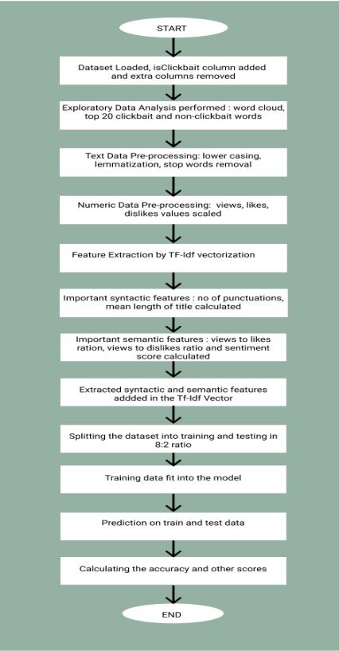

    Flow Chart of the Approach

In the case of BERT:

- 
 Each lemmatized video title is tokenized and converted to a vector representation using the pretrained tokenizers of BERT. 

- 
 A base pretrained model for BERT is imported as a local variable and additional layers according to our problem statement are being added and compiled(transfer learning). 

- The vectors are then sent as input to the BERT model.
- The output of the BERT model is trained further using the tensorflow Dense layers.
- 
 The models are trained based on this data and used to predict the final classification for the isClickbait column. 

    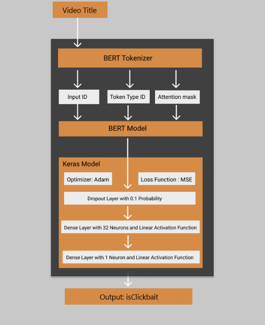

    BERT Text Classifier

The dataset has been taken from a well known online community for data scientists known as kaggle. There are two different types of datasets that we have used. 

#### Datasets

The <b> first dataset </b> had the attributes ID, Video Title, Views, Likes, Dislikes and Favorites. There were two csv files for the first dataset. The first csv file consisted of the data which were clickbaits and the second csv file was for the data which were non clickbaits. As these were two different files so we had to import them and then merge the data from both the files. After merging the datas from both the files we randomized the rows so that the clickbait and non clickbait data get mixed properly. This dataset contains more than 32,000 rows of data. This dataset contains youtube titles from various channels available on youtube. In this dataset the features such as ID and Favorites are of no use in training the Machine Learning and Deep Learning models because they are not affecting the result if the video is clickbait or not. So we are going to use the rest of the features such as Video Title, Views, Likes and Dislikes to train the models and then use it to classify other Videos. We added another column named “isClickbait”. The clickbait data were put as 1 and non clickbait data were put as 0 in this column and then jumbled. 

<b> Columns: </b> ID, Video Title, Views, Likes, Dislikes, Favorites, isClickbait

 The second dataset that we are going to use is updated on a daily basis. It has many more features compared to the first dataset. It has features such as Video ID, Video Title, Published At, Channel ID, Channel Title, Category ID, Trending Date, View Count, Likes, Dislikes, Comment Count and Description. The unique proposition of this dataset is that it has headlines in Hindi, Malayalam, Tamil, Telugu and Kannada, so with this dataset we can even classify titles with multilingual headlines. The features such as Video ID, Published At, Channel ID, Category ID, Trending Date are not useful for training because they are just used as identifiers. The main problem with this dataset is that we have to manually read the rows and classify it as clickbait or non-clickbait. So we have to add another column called “isClickbait” and put all the values there after the manual classification. The useful features that we are going to use are Video Title, Channel Title, View Count, Likes, Dislikes, Comment Count and Description, these will be used to train the different models. 

 <b> Columns: </b> Video_ID, Video_Title, Published_At, Channel_ID, Channel_Title, Category_ID, Trending_Date, View_Count, Likes, Dislikes,Comment_Count, Description, isClickbait 

#### Limitation

One of the major limitations of the BERT text classification algorithm is lack of ability to handle long text sequences. By default, BERT supports up to 512 tokens. There are multiple ways to overcome it: Ignore text after 512 tokens. 

## Results and Discussions

### Data Analysis

#### Preprocessing Results: Lower Casing, Stop Word Removal and Lemmatization

    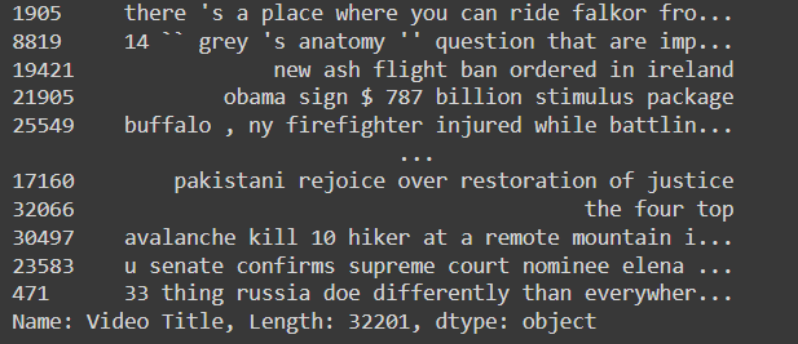

#### Missing Numbers in Dataset

    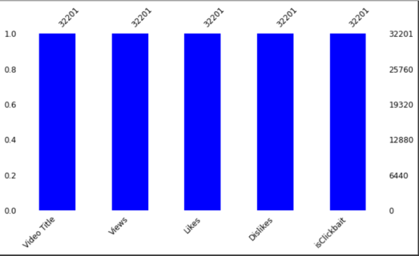

#### Word Cloud of Video Titles

    

#### Top 20 Unigrams

    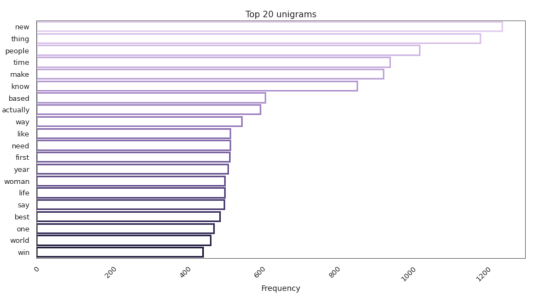

#### Top 20 Bigrams

    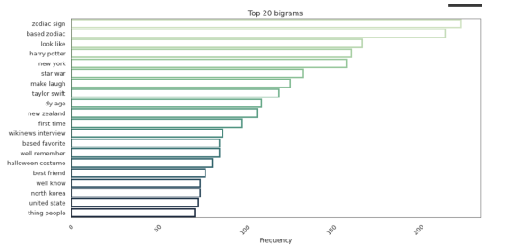

#### Top 20 Trigrams

    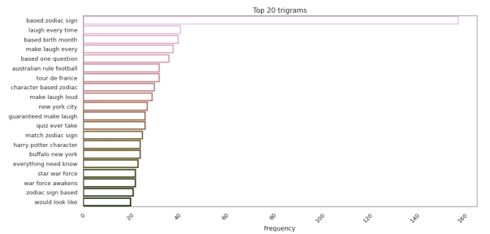

#### Target Distribution

    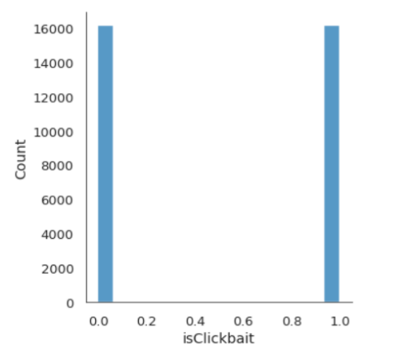

#### Top 20 Clickbait Headline Words

    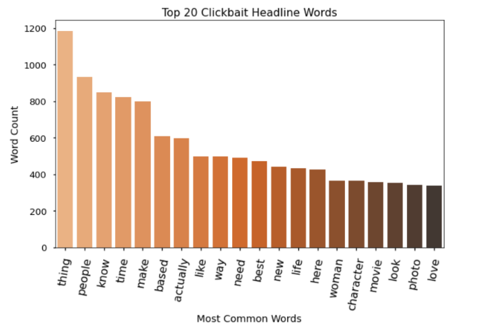

#### Top 20 Non - Clickbait Headline Words

    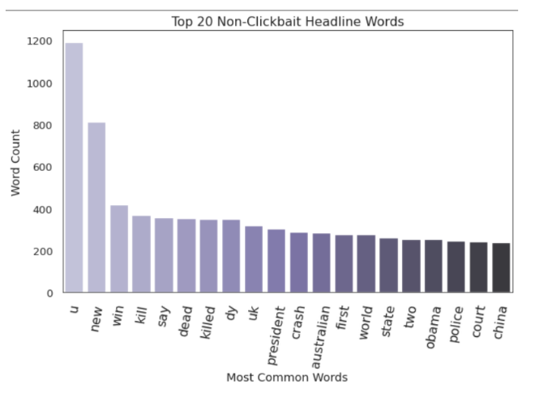

The final output for each row of data is a binary label of 0 referring to the title being non-clickbait and 1 referring to the title being clickbait. We expect an accuracy above 95% for the english video titles dataset and above 90% for the multilingual video titles dataset.

### Model Accuracy

#### Naive Bayes

    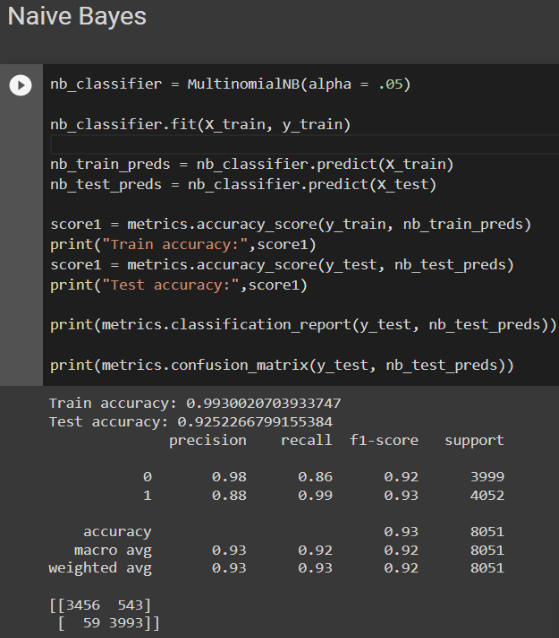

    Naive Bayes Classifier Results

#### Random Forest

    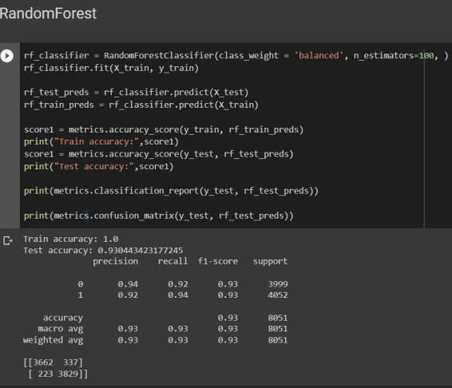

    Random Forest Classifier Results

#### SVM

    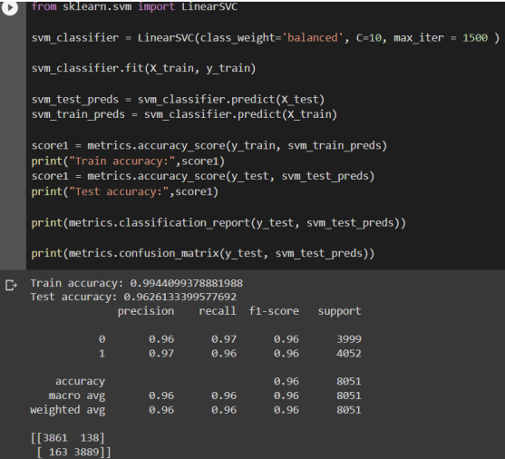

    SVM Classifier Results

#### XG Boost

    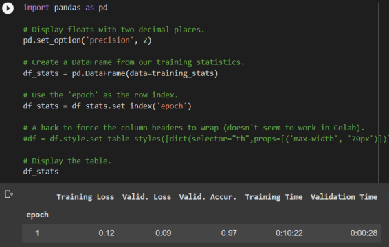

    Feature Extraction using XG Boost

#### BERT

    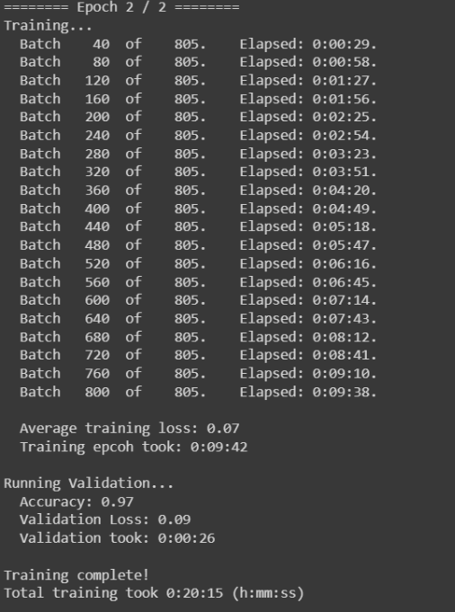

    Training the BERT Model

### Comparison

    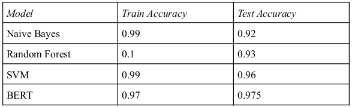

    Result Comparison

### Indian Language Dataset

    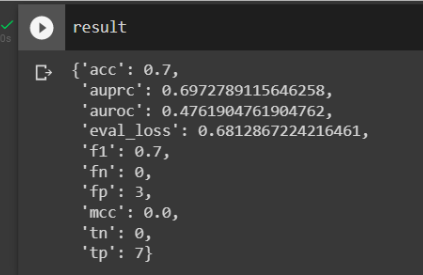

    Result from Indian Language Dataset

 

As seen above, the accuracy of prediction is 70% on the Indian languages youtube dataset. This is almost at par with the state of the art results obtained by training mBERT.

 

    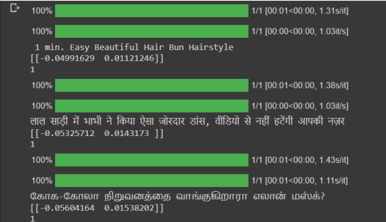

    Manual Classification Results on Indian Language Trained Model

 

As shown above we have correctly classified three clickbait titles in English, Hindi and Tamil.

## Summary

The results that we have got from the BERT text classification algorithm is better than other Machine Learning algorithms. The testing accuracy for BERT was 97% in the case of the English Language dataset and 70% in the case of the Indian Language dataset. For the Machine Learning algorithms such as Naive Bayes, Random Forest and SVM, the testing accuracy was 92%, 93% and 96% respectively.

